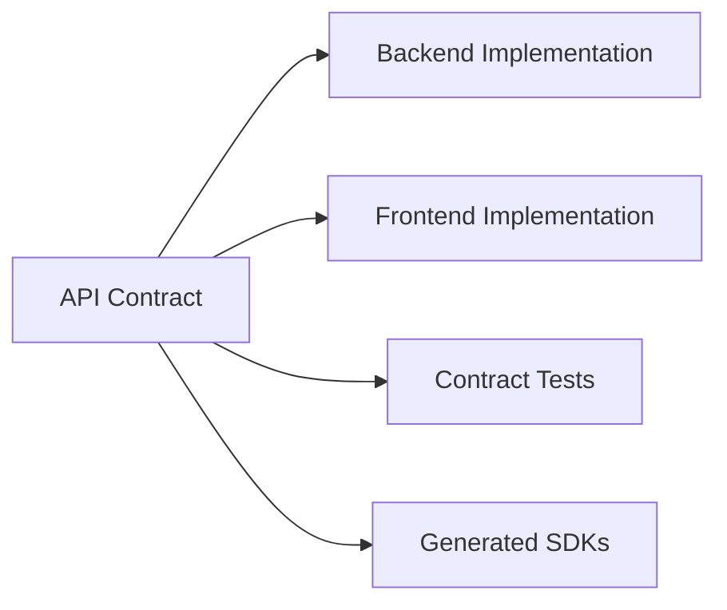
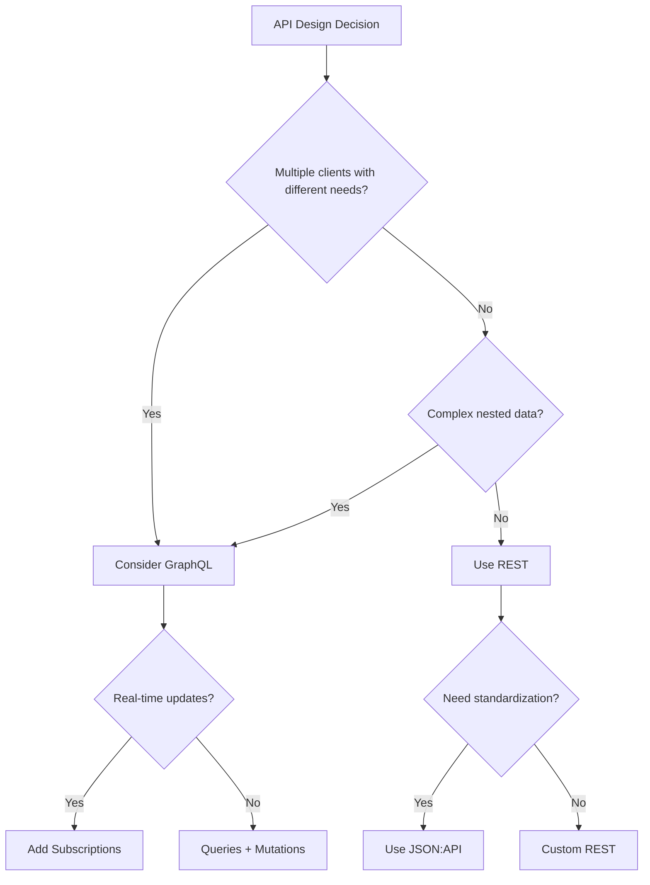

# API Design Principles for Framework Development

This skill provides guidance on designing APIs during Phase 3 (Planning) of framework development. It covers contract-first design, REST and GraphQL patterns, and how to create specifications that enable multi-agent development.

## Contract-First Design

Define API contracts before implementation. This enables:
- Parallel development (frontend and backend work simultaneously)
- Clear boundaries for agent assignment (Phase 4)
- Automated testing against contracts
- Client SDK generation



## REST API Design Principles

### Resource Naming

Use nouns for resources, not verbs:

```
Good:
  GET    /tasks          - List tasks
  POST   /tasks          - Create task
  GET    /tasks/{id}     - Get task
  PUT    /tasks/{id}     - Update task
  DELETE /tasks/{id}     - Delete task

Bad:
  GET    /getTasks
  POST   /createTask
  POST   /deleteTask
```

### HTTP Methods

| Method | Purpose | Idempotent | Safe |
|--------|---------|------------|------|
| GET | Retrieve resource | Yes | Yes |
| POST | Create resource | No | No |
| PUT | Replace resource | Yes | No |
| PATCH | Partial update | No | No |
| DELETE | Remove resource | Yes | No |

### URL Structure

```
/api/v1/{resource}/{id}/{sub-resource}/{sub-id}

Examples:
  /api/v1/projects/123/tasks
  /api/v1/users/456/preferences
  /api/v1/teams/789/members/101
```

### Query Parameters

For filtering, sorting, and pagination:

```
GET /tasks?status=active&priority=high&sort=-createdAt&page=1&limit=20

Conventions:
  - Filter:  ?field=value
  - Sort:    ?sort=field (ascending) or ?sort=-field (descending)
  - Page:    ?page=1&limit=20 or ?offset=0&limit=20
  - Fields:  ?fields=id,title,status (sparse fieldsets)
  - Include: ?include=assignee,project (related resources)
```

### Response Structure

Consistent response envelope:

```json
{
  "data": {
    "id": "task-123",
    "type": "task",
    "attributes": {
      "title": "Implement login",
      "status": "active",
      "priority": "high"
    },
    "relationships": {
      "assignee": {
        "data": { "type": "user", "id": "user-456" }
      }
    }
  },
  "included": [
    {
      "type": "user",
      "id": "user-456",
      "attributes": { "name": "John Doe" }
    }
  ],
  "meta": {
    "totalCount": 150,
    "page": 1,
    "limit": 20
  }
}
```

### Error Response Structure

```json
{
  "errors": [
    {
      "status": "422",
      "code": "VALIDATION_ERROR",
      "title": "Invalid attribute",
      "detail": "Title must be at least 3 characters",
      "source": {
        "pointer": "/data/attributes/title"
      }
    }
  ]
}
```

### HTTP Status Codes

| Code | Meaning | When to Use |
|------|---------|-------------|
| 200 | OK | Successful GET, PUT, PATCH |
| 201 | Created | Successful POST with new resource |
| 204 | No Content | Successful DELETE |
| 400 | Bad Request | Malformed request syntax |
| 401 | Unauthorized | Missing or invalid auth |
| 403 | Forbidden | Valid auth but insufficient permissions |
| 404 | Not Found | Resource doesn't exist |
| 409 | Conflict | Resource state conflict |
| 422 | Unprocessable Entity | Validation errors |
| 429 | Too Many Requests | Rate limit exceeded |
| 500 | Internal Server Error | Server-side failure |

## GraphQL Design Principles

### Schema-First Design

Define schema before resolvers:

```graphql
type Task {
  id: ID!
  title: String!
  description: String
  status: TaskStatus!
  priority: Priority!
  assignee: User
  project: Project!
  subtasks: [Task!]!
  createdAt: DateTime!
  updatedAt: DateTime!
}

enum TaskStatus {
  TODO
  IN_PROGRESS
  IN_REVIEW
  DONE
}

enum Priority {
  LOW
  MEDIUM
  HIGH
  URGENT
}

type Query {
  task(id: ID!): Task
  tasks(
    filter: TaskFilterInput
    sort: TaskSortInput
    pagination: PaginationInput
  ): TaskConnection!
}

type Mutation {
  createTask(input: CreateTaskInput!): TaskPayload!
  updateTask(id: ID!, input: UpdateTaskInput!): TaskPayload!
  deleteTask(id: ID!): DeletePayload!
}

input CreateTaskInput {
  title: String!
  description: String
  priority: Priority = MEDIUM
  projectId: ID!
  assigneeId: ID
}
```

### Connection Pattern for Pagination

```graphql
type TaskConnection {
  edges: [TaskEdge!]!
  pageInfo: PageInfo!
  totalCount: Int!
}

type TaskEdge {
  node: Task!
  cursor: String!
}

type PageInfo {
  hasNextPage: Boolean!
  hasPreviousPage: Boolean!
  startCursor: String
  endCursor: String
}
```

### Input Validation

Define validation in schema:

```graphql
input CreateTaskInput {
  title: String! @constraint(minLength: 3, maxLength: 200)
  description: String @constraint(maxLength: 5000)
  priority: Priority = MEDIUM
}
```

### Error Handling

Use union types for expected errors:

```graphql
type TaskPayload {
  task: Task
  errors: [UserError!]!
}

type UserError {
  field: [String!]
  message: String!
  code: ErrorCode!
}

enum ErrorCode {
  VALIDATION_ERROR
  NOT_FOUND
  PERMISSION_DENIED
  CONFLICT
}
```

## API Versioning Strategies

### URL Path Versioning (Recommended for REST)

```
/api/v1/tasks
/api/v2/tasks
```

Pros: Explicit, easy to route, cacheable
Cons: URL pollution, harder to deprecate

### Header Versioning

```
GET /api/tasks
Accept: application/vnd.myapp.v2+json
```

Pros: Clean URLs
Cons: Less visible, harder to test

### GraphQL Versioning

Avoid versioning in GraphQL. Instead:
- Use @deprecated directive for fields
- Add new fields alongside old ones
- Remove deprecated fields after migration period

```graphql
type Task {
  title: String!
  name: String @deprecated(reason: "Use title instead")
}
```

## Validation Rules

### Request Validation

```yaml
CreateTask:
  title:
    type: string
    required: true
    minLength: 3
    maxLength: 200
    pattern: "^[^<>]*$"  # No HTML tags

  description:
    type: string
    required: false
    maxLength: 5000

  priority:
    type: enum
    values: [low, medium, high, urgent]
    default: medium

  dueDate:
    type: datetime
    format: ISO8601
    mustBeFuture: true
```

### Response Validation

Ensure responses match contracts:

```javascript
// Example validation middleware
const validateResponse = (schema) => (req, res, next) => {
  const originalJson = res.json;
  res.json = (data) => {
    const validation = schema.validate(data);
    if (!validation.valid) {
      logger.error('Response validation failed', validation.errors);
    }
    return originalJson.call(res, data);
  };
  next();
};
```

## Security Considerations

### Authentication

```yaml
endpoints:
  /api/v1/tasks:
    GET:
      auth: required
      scopes: [tasks:read]
    POST:
      auth: required
      scopes: [tasks:write]

  /api/v1/public/status:
    GET:
      auth: none
```

### Rate Limiting

```yaml
rateLimits:
  default:
    requests: 100
    window: 60s

  authenticated:
    requests: 1000
    window: 60s

  endpoints:
    /api/v1/search:
      requests: 20
      window: 60s
```

### Input Sanitization

- Validate all inputs against expected types
- Sanitize strings to prevent XSS
- Parameterize queries to prevent injection
- Limit request body size
- Validate content types

## Phase 3 Integration Checklist

When defining APIs during framework planning:

1. **List all resources** from Phase 2 module breakdown
2. **Define CRUD operations** for each resource
3. **Map relationships** between resources
4. **Document authentication requirements** per endpoint
5. **Specify validation rules** for all inputs
6. **Design error responses** with consistent codes
7. **Plan pagination** for list endpoints
8. **Version strategy** decided and documented

## API Contract Documentation

Create contracts that enable agent assignment:

```markdown
## Task API Contract

### Resource: Task

**Endpoints:**
| Method | Path | Description | Auth | Scope |
|--------|------|-------------|------|-------|
| GET | /tasks | List tasks | Yes | tasks:read |
| POST | /tasks | Create task | Yes | tasks:write |
| GET | /tasks/{id} | Get task | Yes | tasks:read |
| PUT | /tasks/{id} | Update task | Yes | tasks:write |
| DELETE | /tasks/{id} | Delete task | Yes | tasks:delete |

**Request Schema (POST /tasks):**
[JSON Schema here]

**Response Schema (200 OK):**
[JSON Schema here]

**Error Codes:**
[Error code definitions]

**Dependencies:**
- Requires User API for assignee validation
- Requires Project API for project validation

**Agent Assignment:**
- Backend Agent: Implement endpoints
- Frontend Agent: Consume API per contract
- Test Agent: Validate contract compliance
```

## API Design Decision Tree



## Research Before Finalizing

Before finalizing API design:

1. Search for "[Domain] API design best practices"
2. Review similar successful APIs in the space
3. Check framework-specific conventions (Rails, Express, FastAPI)
4. Validate security requirements against OWASP API Top 10
5. Document decisions in ADRs
