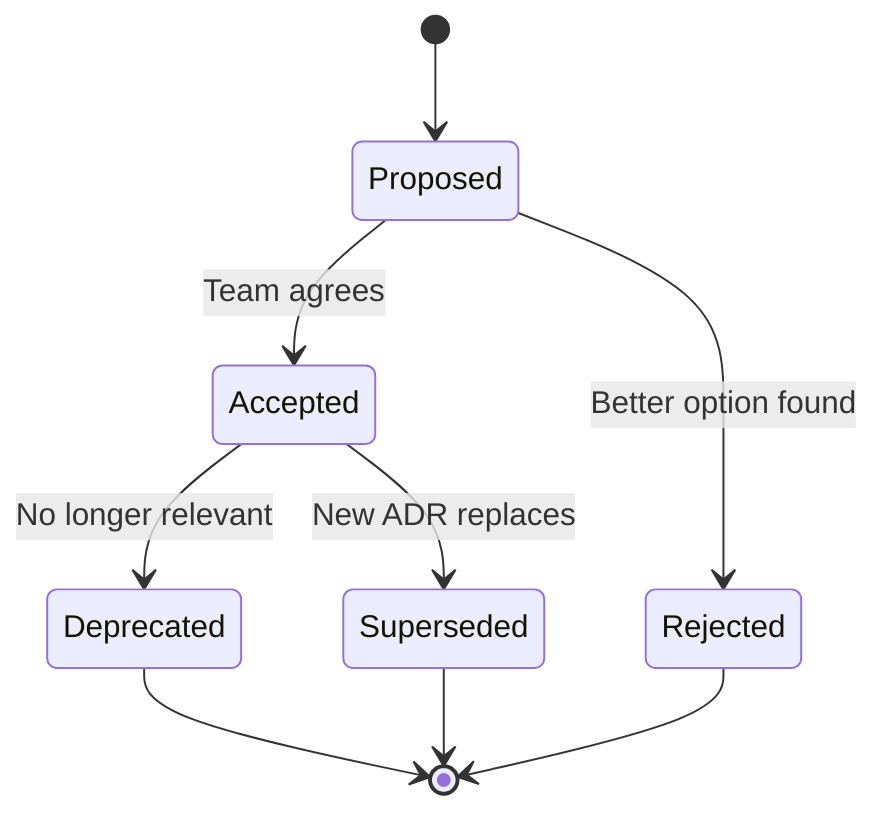

# Architecture Decision Records for Framework Development

This skill provides templates and guidance for documenting architectural decisions made during framework planning. ADRs capture the context, decision, and consequences of significant technical choices.

## When to Write an ADR

Create an ADR when:
- Choosing between technology options (database, framework, language)
- Selecting an architecture pattern (Clean, Hexagonal, DDD)
- Defining API design approach (REST vs GraphQL)
- Making deployment decisions (monolith vs microservices)
- Establishing coding standards that affect structure
- Any decision that would be hard to reverse

## ADR Template for Framework Development

```markdown
# ADR-[NUMBER]: [TITLE]

## Status
[Proposed | Accepted | Deprecated | Superseded by ADR-XXX]

## Context
What is the issue that we're seeing that motivates this decision?
- Current situation
- Problem statement
- Constraints we're operating under
- Framework phase this relates to

## Decision Drivers
- [Driver 1: e.g., Team expertise]
- [Driver 2: e.g., Time to market]
- [Driver 3: e.g., Scalability requirements]
- [Driver 4: e.g., Budget constraints]

## Considered Options
1. [Option 1]
2. [Option 2]
3. [Option 3]

## Decision
We will use [OPTION] because [REASONING].

## Consequences

### Positive
- [Benefit 1]
- [Benefit 2]

### Negative
- [Drawback 1]
- [Drawback 2]

### Neutral
- [Side effect that's neither good nor bad]

## Research Sources
- [URL 1]: [What it confirmed]
- [URL 2]: [What it confirmed]

## Related Decisions
- ADR-XXX: [Related decision title]
- Blueprint file: [path/to/blueprint.md]

## Phase Connection
This decision was made during Phase [N] and affects:
- Phase [X]: [How it affects that phase]
- Phase [Y]: [How it affects that phase]
```

## Framework-Specific ADR Examples

### Example 1: Technology Stack Decision (Phase 1)

```markdown
# ADR-001: Backend Framework Selection

## Status
Accepted

## Context
We are building an offline-first task management application. The backend
needs to handle:
- Real-time sync with conflict resolution
- Multi-tenant data isolation
- RESTful API for mobile and web clients
- WebSocket support for live updates

Team has 3 developers with Node.js and Python experience.

## Decision Drivers
- Real-time capability requirement
- Team's existing expertise
- Ecosystem for offline-sync libraries
- Time to MVP (3 months)

## Considered Options
1. Node.js with Express + Socket.io
2. Python with FastAPI + WebSockets
3. Go with Gin + Gorilla WebSocket
4. Elixir with Phoenix LiveView

## Decision
We will use **Node.js with Express + Socket.io** because:
- Team has strongest Node.js experience (reduces ramp-up)
- Socket.io handles WebSocket fallbacks automatically
- Rich npm ecosystem for sync libraries (y-js, automerge)
- Shared language with React Native mobile app

## Consequences

### Positive
- Fast development start (no learning curve)
- Code sharing potential between backend and mobile
- Large talent pool for future hires

### Negative
- Single-threaded limitations for CPU-intensive tasks
- Need to be careful with callback hell / promise chains
- Less type safety than Go or typed Python

### Neutral
- Will need to implement clustering for horizontal scale

## Research Sources
- https://socket.io/docs/: Confirmed automatic fallback support
- https://nodejs.org/en/about/: Event-driven architecture fits our use case
- https://automerge.org/: CRDT library available for Node.js

## Phase Connection
- Phase 2: Module structure will follow Express router patterns
- Phase 3: API design will use Express middleware conventions
- Phase 4: Frontend agent can share TypeScript types with backend
```

### Example 2: Architecture Pattern Decision (Phase 2)

```markdown
# ADR-002: Hexagonal Architecture for Core Module

## Status
Accepted

## Context
The task management core needs to:
- Connect to PostgreSQL for persistence
- Send notifications via email, push, and SMS
- Integrate with calendar services (Google, Outlook)
- Support future integrations we can't predict

Different teams will work on core logic vs integrations.

## Decision Drivers
- Need to isolate core from integration complexity
- Multiple external service dependencies
- Requirement to swap notification providers
- Testing core logic without real services

## Considered Options
1. Traditional layered architecture
2. Clean Architecture
3. Hexagonal Architecture (Ports and Adapters)

## Decision
We will use **Hexagonal Architecture** because:
- Explicit ports define clear team boundaries
- Adapters can be developed and tested independently
- Easy to add new integrations without touching core
- Natural fit for our multi-agent development approach

## Consequences

### Positive
- Clear boundaries for Phase 4 agent assignment
- Each adapter can be a separate task for different LLMs
- Core logic fully testable with mock adapters

### Negative
- More interfaces to define upfront
- Overhead for simple CRUD operations
- Team needs to understand port/adapter concepts

## Phase Connection
- Phase 3: Each port becomes an API contract specification
- Phase 4: Core agent works on domain, adapter agents work on integrations
- Phase 5: Adapters can be developed in parallel, core must finish first
```

### Example 3: API Design Decision (Phase 3)

```markdown
# ADR-003: REST with JSON:API Specification

## Status
Accepted

## Context
Need to design API contracts for:
- Mobile app (React Native)
- Web app (React)
- Future third-party integrations
- Webhook callbacks

Considering standardized formats for consistency.

## Decision Drivers
- Consistency across all endpoints
- Client library generation support
- Pagination and filtering standards
- Error handling conventions

## Considered Options
1. Custom REST conventions
2. JSON:API specification
3. GraphQL
4. gRPC with REST gateway

## Decision
We will use **JSON:API specification** because:
- Standardized pagination, filtering, and sparse fieldsets
- OpenAPI generators support JSON:API
- Reduces bikeshedding on response formats
- Good fit for resource-oriented task management domain

## Consequences

### Positive
- Consistent API structure from day one
- Client libraries can be generated
- Well-documented specification to reference

### Negative
- Verbose responses compared to custom REST
- Learning curve for developers new to JSON:API
- Some flexibility sacrificed for consistency

## Research Sources
- https://jsonapi.org/: Full specification reference
- https://openapi-generator.tech/: Confirmed JSON:API support

## Phase Connection
- Phase 3: All endpoint definitions follow JSON:API structure
- Phase 4: API specification serves as contract between agents
- Phase 6: Integration testing validates JSON:API compliance
```

## ADR File Organization

Store ADRs alongside blueprint files:

```
project-root/
  docs/
    architecture/
      decisions/
        ADR-001-backend-framework.md
        ADR-002-hexagonal-architecture.md
        ADR-003-api-specification.md
        ADR-004-database-selection.md
      blueprints/
        module-overview.md
        api-contracts.md
        deployment-strategy.md
```

## ADR Numbering Convention

- **ADR-0XX:** Foundation decisions (stack, patterns, standards)
- **ADR-1XX:** Backend architecture decisions
- **ADR-2XX:** Frontend architecture decisions
- **ADR-3XX:** Infrastructure and deployment decisions
- **ADR-4XX:** Security and compliance decisions
- **ADR-5XX:** Integration and API decisions

## ADR Lifecycle



## Connecting ADRs to Framework Phases

| Phase | ADR Focus |
|-------|-----------|
| Phase 1: Discovery | Technology stack, high-level patterns |
| Phase 2: Structure | Module boundaries, architecture patterns |
| Phase 3: Planning | API design, data models, coding standards |
| Phase 4: Agents | Agent capabilities, task boundaries |
| Phase 5: Execution | Handoff protocols, integration points |
| Phase 6: Integration | Conflict resolution, final standards |

## ADR Review Checklist

Before finalizing an ADR:

- [ ] Context clearly explains the problem
- [ ] At least 2-3 options were considered
- [ ] Decision includes explicit reasoning
- [ ] Both positive and negative consequences listed
- [ ] Research sources with URLs included
- [ ] Related ADRs and blueprint files linked
- [ ] Phase connections documented
- [ ] Status is set correctly

## Quick ADR for Minor Decisions

For smaller decisions, use a lightweight format:

```markdown
# ADR-0XX: [Title]

**Status:** Accepted
**Date:** YYYY-MM-DD
**Context:** [One paragraph]
**Decision:** We will [choice] because [reason].
**Consequences:** [Bullet points]
```

## Generating ADRs During Planning

When the Framework Developer Orchestrator makes a recommendation:

1. Document the research performed (search queries, sources)
2. Record the options presented to the user
3. Capture the user's decision and reasoning
4. Auto-generate an ADR draft for review
5. Link to the relevant phase checkpoint
