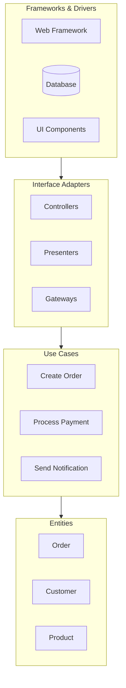
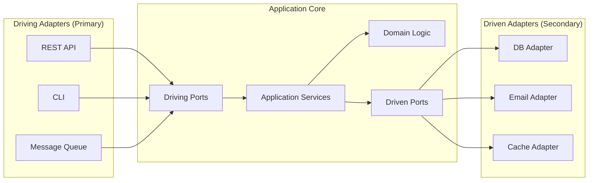
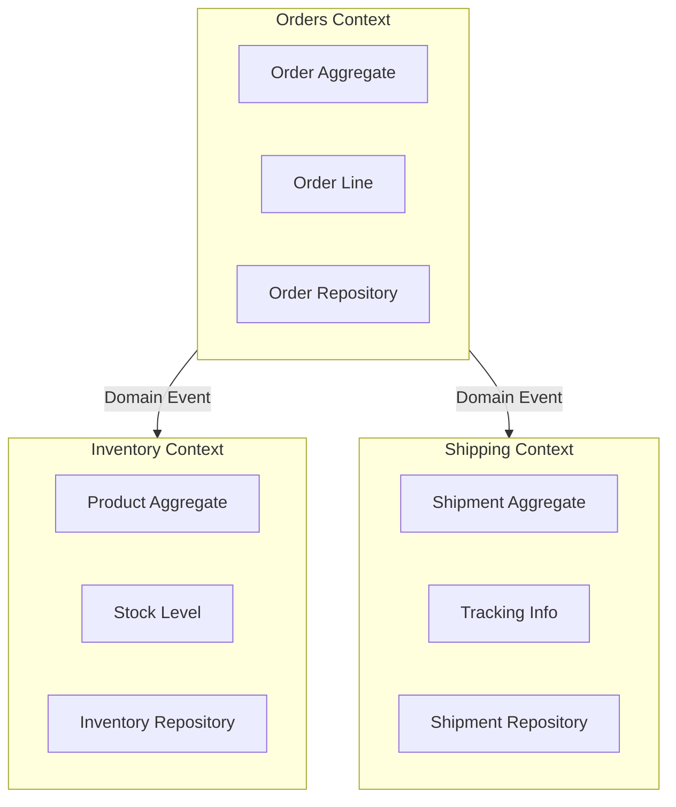
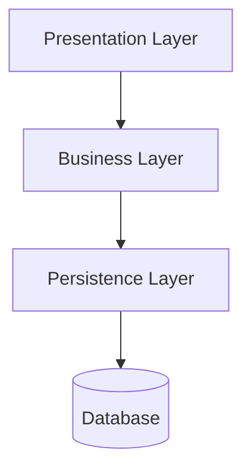
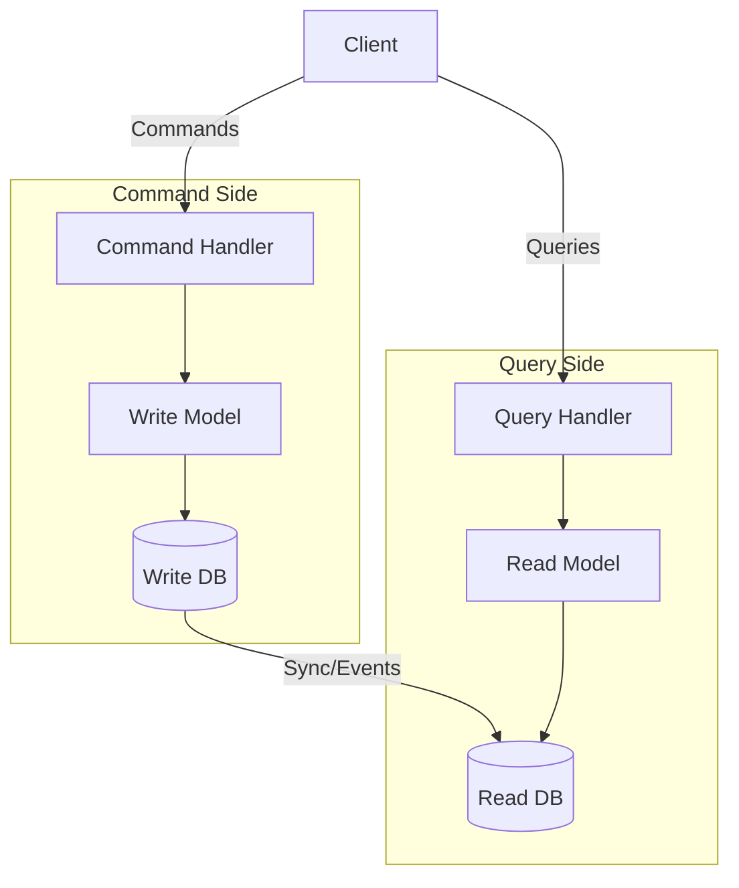

# Architecture Patterns for Framework Development

This skill provides guidance on selecting and implementing architecture patterns during the framework planning process. Use it during Phase 2 (Structure) when breaking down modules and defining relationships.

## Decision Framework

Before recommending a pattern, evaluate these criteria:

| Criterion | Questions to Ask |
|-----------|------------------|
| Team Size | How many developers? Can they handle complexity? |
| Domain Complexity | Is business logic complex or straightforward? |
| Scale Requirements | Expected users? Data volume? Growth trajectory? |
| Change Frequency | Which parts change most often? |
| Integration Needs | How many external systems? |
| Deployment Model | Monolith, modular monolith, or distributed? |

## Core Patterns

### Clean Architecture

Apply Clean Architecture when the project has complex business rules that must remain independent of frameworks, databases, and UI.

```
Structure:
- Entities (innermost): Core business objects
- Use Cases: Application-specific business rules
- Interface Adapters: Controllers, presenters, gateways
- Frameworks & Drivers (outermost): Web, DB, external interfaces
```



**Dependency Rule:** Source code dependencies point inward only. Inner layers know nothing about outer layers.

**When to Use:**
- Business logic must survive framework changes
- Multiple delivery mechanisms (API, CLI, queue workers)
- Long-lived projects where maintainability matters
- Teams with varying skill levels (clear boundaries help)

**Phase 2 Integration:** Define entities first, then use cases, then adapters. Map each module to a layer.

### Hexagonal Architecture (Ports and Adapters)

Apply Hexagonal Architecture when the system must integrate with multiple external systems and you want to isolate the core from infrastructure concerns.



**Port Types:**
- **Driving Ports (Primary):** Interfaces that the application exposes (e.g., `OrderService`)
- **Driven Ports (Secondary):** Interfaces that the application requires (e.g., `OrderRepository`)

**When to Use:**
- Multiple input channels (REST, GraphQL, CLI, events)
- Multiple output channels (different databases, external APIs)
- Need to swap implementations easily (testing, migration)
- Microservices with clear bounded contexts

**Phase 3 Integration:** Define ports as API contracts. Each port becomes an interface specification.

### Domain-Driven Design (DDD)

Apply DDD patterns when the problem domain is complex and requires close collaboration between developers and domain experts.

**Strategic Patterns:**



**Tactical Patterns:**
- **Aggregates:** Cluster of domain objects treated as a unit
- **Entities:** Objects with identity that persists over time
- **Value Objects:** Immutable objects defined by attributes
- **Domain Events:** Record of something significant that happened
- **Repositories:** Abstract data access for aggregates

**When to Use:**
- Complex business domains with rich rules
- Need ubiquitous language between devs and stakeholders
- Multiple bounded contexts with different models
- Long-term strategic investment in the domain model

**Phase 1-2 Integration:** Use DDD discovery techniques (event storming, domain storytelling) during Phase 1. Map bounded contexts in Phase 2.

### Layered Architecture

Apply traditional layered architecture for simpler applications with straightforward CRUD operations.



**Layers:**
- **Presentation:** UI components, API controllers
- **Business:** Business rules, validation, workflows
- **Persistence:** Data access, ORM, caching

**When to Use:**
- Simple CRUD applications
- Small teams with limited architecture experience
- Rapid prototyping or MVP development
- Applications with minimal business logic

**Caution:** Avoid for complex domains; leads to anemic domain models and transaction scripts.

### CQRS (Command Query Responsibility Segregation)

Apply CQRS when read and write patterns differ significantly or when you need different models for queries and commands.



**When to Use:**
- Read/write ratio heavily skewed (e.g., 100:1 reads to writes)
- Complex queries that don't fit the write model
- Need to scale reads and writes independently
- Combined with event sourcing for audit trails

**Phase 3 Integration:** Separate command APIs from query APIs. Define sync mechanisms.

## Pattern Comparison Matrix

| Pattern | Complexity | Best For | Team Size | Learning Curve |
|---------|------------|----------|-----------|----------------|
| Layered | Low | Simple CRUD | 1-3 | Low |
| Clean | Medium | Complex business logic | 3-10 | Medium |
| Hexagonal | Medium | Many integrations | 3-10 | Medium |
| DDD | High | Complex domains | 5+ | High |
| CQRS | High | Asymmetric read/write | 5+ | High |
| Microservices | Very High | Large scale, multiple teams | 10+ | Very High |

## Framework Phase Mapping

| Pattern | Phase 1 | Phase 2 | Phase 3 | Phase 4 |
|---------|---------|---------|---------|---------|
| Clean | Identify entities | Layer modules | Use case APIs | Core team does entities |
| Hexagonal | Identify integrations | Define ports | Port contracts | Adapter teams separate |
| DDD | Event storming | Bounded contexts | Aggregate APIs | Context per team |
| CQRS | Identify queries vs commands | Separate models | Dual APIs | Command/query teams |

## Implementation Checklist

When applying a pattern during Phase 2:

1. **Document the decision** using an Architecture Decision Record (ADR)
2. **Map modules to pattern elements** (layers, ports, contexts)
3. **Define boundaries** with clear interfaces
4. **Identify cross-cutting concerns** (logging, auth, transactions)
5. **Plan for testing** at each boundary
6. **Create Mermaid diagrams** showing the structure

## Anti-Patterns to Avoid

- **Big Ball of Mud:** No clear structure, everything depends on everything
- **Golden Hammer:** Using one pattern for all problems
- **Premature Distribution:** Microservices before you need them
- **Leaky Abstractions:** Inner layers knowing about outer layer details
- **Anemic Domain Model:** Entities with only getters/setters, logic in services

## Research Requirements

Before finalizing pattern choice:
1. Search for "[Pattern] + [Tech Stack] implementation"
2. Review official documentation for framework-specific guidance
3. Look for case studies in similar domains
4. Verify pattern fits the team's experience level
