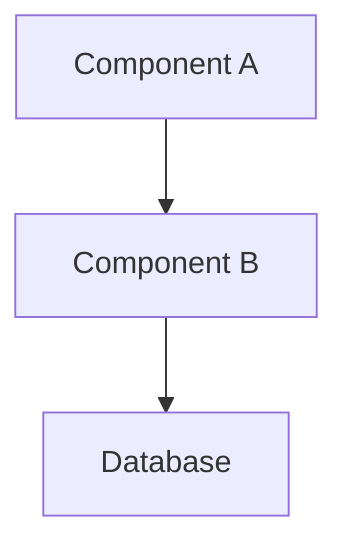

# Handoff Template

> **Usage:** Copy this template to `.framework-blueprints/05-execution/handoffs/handoff-NNN.md`
> for each agent-to-agent or phase transition handoff.

---

## Handoff Header

| Field | Value |
|-------|-------|
| **Handoff ID** | `HO-001` |
| **Date** | <!-- YYYY-MM-DD --> |
| **From Agent** | <!-- Agent name --> |
| **From LLM** | <!-- LLM name (Claude, GPT-4, etc.) --> |
| **To Agent** | <!-- Agent name --> |
| **To LLM** | <!-- LLM name --> |
| **Status** | `pending` / `accepted` / `in_progress` / `completed` |

---

## Summary

<!-- 2-3 sentences describing what was completed and what's being handed off -->

---

## Completed Work

### Tasks Finished

- [x] <!-- Task 1 -->
- [x] <!-- Task 2 -->
- [x] <!-- Task 3 -->

### Artifacts Delivered

| Artifact | Location | Description |
|----------|----------|-------------|
| <!-- File/Component --> | <!-- Path --> | <!-- What it does --> |
| <!-- File/Component --> | <!-- Path --> | <!-- What it does --> |

### Tests Passing

| Test Suite | Status | Coverage |
|------------|--------|----------|
| Unit Tests | Passing | 85% |
| Integration | Passing | 70% |

---

## Receiving Agent Tasks

### What To Do Next

1. [ ] <!-- Task for receiving agent -->
2. [ ] <!-- Task for receiving agent -->
3. [ ] <!-- Task for receiving agent -->

### Dependencies to Use

| Dependency | Version | Purpose |
|------------|---------|---------|
| <!-- Package --> | <!-- Version --> | <!-- Why --> |

### APIs to Consume

| Endpoint | Purpose | Documentation |
|----------|---------|---------------|
| `POST /api/resource` | <!-- Purpose --> | See `api-contracts.md` |

---

## Shared Context

### Project Context
<!-- Key information the receiving agent needs to know about the project -->

### Technical Decisions
<!-- Decisions already made that affect this work -->

| Decision | Reason | Source |
|----------|--------|--------|
| <!-- Decision --> | <!-- Why --> | <!-- URL --> |

### Constraints
<!-- Technical or business constraints to be aware of -->

- <!-- Constraint 1 -->
- <!-- Constraint 2 -->

---

## Known Issues

### Open Issues

| ID | Description | Severity | Workaround |
|----|-------------|----------|------------|
| <!-- ID --> | <!-- Issue --> | High/Med/Low | <!-- If any --> |

### Technical Debt

<!-- Technical debt being passed on -->

- [ ] <!-- Debt item 1 -->
- [ ] <!-- Debt item 2 -->

---

## Environment Setup

### Required Environment Variables

```bash
# Copy to .env
DATABASE_URL=<!-- value -->
API_KEY=<!-- value -->
```

### Local Setup Commands

```bash
# Commands to set up the project locally
npm install
npm run db:migrate
npm run dev
```

---

## Code Context

### Key Files to Review

| File | Purpose | Priority |
|------|---------|----------|
| `src/main.ts` | Entry point | High |
| `src/config.ts` | Configuration | High |
| `src/types.ts` | Type definitions | Medium |

### Architecture Overview



### Naming Conventions

| Entity | Convention | Example |
|--------|------------|---------|
| Files | kebab-case | `user-service.ts` |
| Classes | PascalCase | `UserService` |
| Functions | camelCase | `getUserById` |

---

## Communication

### Questions?

Contact: <!-- How to reach the handing-off agent -->

### Sync Points

| Checkpoint | Date | Purpose |
|------------|------|---------|
| <!-- Checkpoint --> | <!-- Date --> | <!-- Purpose --> |

---

## Acceptance Criteria

The receiving agent should confirm:

- [ ] All artifacts accessible and working
- [ ] Tests passing locally
- [ ] Context understood
- [ ] Questions addressed
- [ ] Ready to proceed

---

## Sign-off

### Handing Off
- **Agent:** <!-- Name -->
- **Date:** <!-- Date -->
- **Signature:** Handoff complete, work verified

### Receiving
- **Agent:** <!-- Name -->
- **Date:** <!-- Date -->
- **Signature:** Handoff accepted, ready to proceed

---

## Revision History

| Version | Date | Author | Changes |
|---------|------|--------|---------|
| 1.0 | <!-- Date --> | <!-- Agent --> | Initial handoff |
