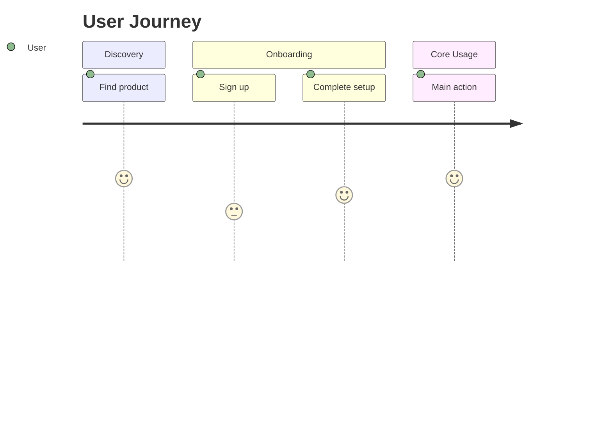
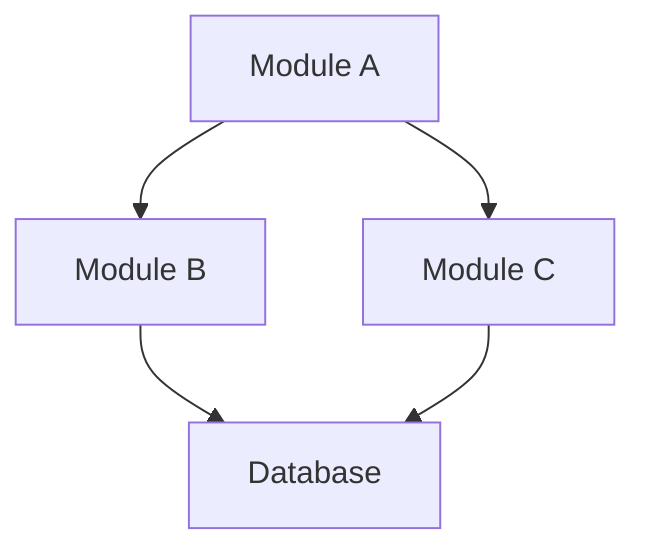

# Project Outline Template

> **Usage:** Copy this template to `.framework-blueprints/01-discovery/outline-v1.md`
> and fill in the sections based on discovery discussions.

---

## Project Overview

### Project Name
<!-- Enter the project name -->

### Version
v1 - Initial Outline

### Created
<!-- Date: YYYY-MM-DD -->

### Author
<!-- Framework Developer Orchestrator + [User Name] -->

---

## Problem Statement

### The Problem
<!-- What specific problem does this project solve? Be concrete. -->

### Current Solutions
<!-- What existing solutions exist? Why are they insufficient? -->

### Gap Analysis
<!-- What gap does this project fill? -->

---

## Target Users

### Primary Users
<!-- Who are the main users? Be specific about roles/personas. -->

| Persona | Description | Key Needs |
|---------|-------------|-----------|
| <!-- Persona 1 --> | <!-- Description --> | <!-- Needs --> |
| <!-- Persona 2 --> | <!-- Description --> | <!-- Needs --> |

### Secondary Users
<!-- Who else might use this system? (admins, integrators, etc.) -->

### User Journey
<!-- High-level flow of how users will interact with the system -->

---

## Core Modules

### Module Overview

| # | Module Name | Purpose | Priority |
|---|-------------|---------|----------|
| 1 | <!-- Module A --> | <!-- One-line purpose --> | P1 |
| 2 | <!-- Module B --> | <!-- One-line purpose --> | P1 |
| 3 | <!-- Module C --> | <!-- One-line purpose --> | P2 |

### Module Details

#### Module 1: <!-- Name -->

**Purpose:**
<!-- Detailed explanation of what this module does -->

**Key Features:**
- <!-- Feature 1 -->
- <!-- Feature 2 -->
- <!-- Feature 3 -->

**Data Handled:**
- <!-- Data type 1 -->
- <!-- Data type 2 -->

---

#### Module 2: <!-- Name -->

**Purpose:**
<!-- Detailed explanation -->

**Key Features:**
- <!-- Feature 1 -->
- <!-- Feature 2 -->

**Data Handled:**
- <!-- Data type 1 -->

---

## Initial Relationships

### Module Dependencies

### Relationship Matrix

| From | To | Relationship Type | Description |
|------|-----|-------------------|-------------|
| Module A | Module B | depends_on | <!-- Description --> |
| Module A | Module C | uses | <!-- Description --> |
| Module B | Database | reads/writes | <!-- Description --> |

---

## Technical Constraints

### Must Have
<!-- Non-negotiable requirements -->
- [ ] <!-- Constraint 1 -->
- [ ] <!-- Constraint 2 -->

### Should Have
<!-- Important but flexible -->
- [ ] <!-- Constraint 1 -->
- [ ] <!-- Constraint 2 -->

### Nice to Have
<!-- Optional features -->
- [ ] <!-- Constraint 1 -->

---

## Initial Decisions

| ID | Decision | Reason | Source | Date |
|----|----------|--------|--------|------|
| D001 | <!-- Decision --> | <!-- Why --> | <!-- URL --> | <!-- Date --> |
| D002 | <!-- Decision --> | <!-- Why --> | <!-- URL --> | <!-- Date --> |

---

## Open Questions

<!-- Questions to resolve in Phase 2 -->

1. [ ] <!-- Question 1 -->
2. [ ] <!-- Question 2 -->
3. [ ] <!-- Question 3 -->

---

## Next Steps

- [ ] Expand each module into sub-components (Phase 2)
- [ ] Define dependency graph (Phase 2)
- [ ] Identify risks (Phase 2)
- [ ] Get user confirmation on this outline

---

## Revision History

| Version | Date | Changes | Author |
|---------|------|---------|--------|
| v1 | <!-- Date --> | Initial outline | Framework Developer |
