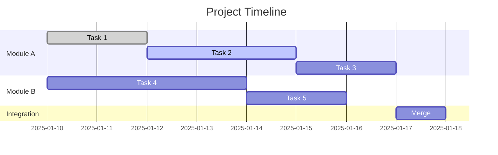

# Progress Tracker Template

> **Usage:** Copy this template to `.framework-blueprints/05-execution/progress-tracker.md`
> and update it continuously during execution phase.

---

## Project Dashboard

### Quick Stats

| Metric | Value |
|--------|-------|
| **Project** | <!-- Project Name --> |
| **Current Phase** | <!-- 1-6 --> |
| **Overall Progress** | <!-- XX% --> |
| **Active Agents** | <!-- N --> |
| **Open Blockers** | <!-- N --> |
| **Last Updated** | <!-- YYYY-MM-DD HH:MM --> |

---

## Agent Status

### Active Agents

| Agent | LLM | Status | Progress | Current Task | Started | ETA |
|-------|-----|--------|----------|--------------|---------|-----|
| <!-- Agent 1 --> | <!-- LLM --> | `active` | <!-- XX% --> | <!-- Task --> | <!-- Date --> | <!-- Date --> |
| <!-- Agent 2 --> | <!-- LLM --> | `waiting` | <!-- XX% --> | <!-- Waiting for --> | - | - |
| <!-- Agent 3 --> | <!-- LLM --> | `blocked` | <!-- XX% --> | <!-- Blocker --> | <!-- Date --> | - |

### Status Legend

| Status | Meaning |
|--------|---------|
| `active` | Currently working |
| `waiting` | Ready but waiting for dependency |
| `blocked` | Cannot proceed due to blocker |
| `reviewing` | Work complete, under review |
| `complete` | All tasks finished |
| `failed` | Encountered unrecoverable error |

---

## Task Progress

### Module: <!-- Module A -->

| Task | Assigned To | Status | Priority | Dependencies | Progress |
|------|-------------|--------|----------|--------------|----------|
| <!-- Task 1 --> | <!-- Agent --> | `done` | P1 | None | 100% |
| <!-- Task 2 --> | <!-- Agent --> | `in_progress` | P1 | Task 1 | 60% |
| <!-- Task 3 --> | <!-- Agent --> | `pending` | P2 | Task 2 | 0% |

### Module: <!-- Module B -->

| Task | Assigned To | Status | Priority | Dependencies | Progress |
|------|-------------|--------|----------|--------------|----------|
| <!-- Task --> | <!-- Agent --> | <!-- Status --> | <!-- P --> | <!-- Deps --> | <!-- % --> |

---

## Critical Path



---

## Blockers

### Active Blockers

| ID | Description | Blocking | Owner | Created | Status |
|----|-------------|----------|-------|---------|--------|
| B001 | <!-- Description --> | <!-- What's blocked --> | <!-- Agent --> | <!-- Date --> | `open` |
| B002 | <!-- Description --> | <!-- What's blocked --> | <!-- Agent --> | <!-- Date --> | `investigating` |

### Resolved Blockers

| ID | Description | Resolution | Resolved By | Date |
|----|-------------|------------|-------------|------|
| B000 | <!-- Description --> | <!-- How resolved --> | <!-- Agent --> | <!-- Date --> |

---

## Handoffs

### Pending Handoffs

| From | To | Artifact | Status | Due |
|------|-----|----------|--------|-----|
| <!-- Agent A --> | <!-- Agent B --> | <!-- What --> | `ready` | <!-- Date --> |

### Completed Handoffs

| ID | From | To | Completed | Notes |
|----|------|-----|-----------|-------|
| HO-001 | <!-- Agent --> | <!-- Agent --> | <!-- Date --> | <!-- Notes --> |

---

## Milestones

### Completed

- [x] **M1:** <!-- Milestone --> (<!-- Date -->)
- [x] **M2:** <!-- Milestone --> (<!-- Date -->)

### Upcoming

- [ ] **M3:** <!-- Milestone --> (Target: <!-- Date -->)
- [ ] **M4:** <!-- Milestone --> (Target: <!-- Date -->)

---

## Timeline

### Recent Activity

| Date | Time | Agent | Activity |
|------|------|-------|----------|
| <!-- Date --> | <!-- Time --> | <!-- Agent --> | <!-- What happened --> |
| <!-- Date --> | <!-- Time --> | <!-- Agent --> | <!-- What happened --> |
| <!-- Date --> | <!-- Time --> | <!-- Agent --> | <!-- What happened --> |

### Upcoming Events

| Date | Event | Owner |
|------|-------|-------|
| <!-- Date --> | <!-- Event --> | <!-- Owner --> |
| <!-- Date --> | <!-- Event --> | <!-- Owner --> |

---

## Quality Metrics

### Test Coverage

| Module | Unit | Integration | E2E |
|--------|------|-------------|-----|
| Module A | 85% | 70% | 50% |
| Module B | 90% | 65% | 40% |
| **Total** | **87%** | **68%** | **45%** |

### Code Quality

| Metric | Target | Current | Status |
|--------|--------|---------|--------|
| Test Coverage | >80% | <!-- % --> | <!-- OK/WARN/FAIL --> |
| Lint Errors | 0 | <!-- N --> | <!-- OK/WARN/FAIL --> |
| Type Errors | 0 | <!-- N --> | <!-- OK/WARN/FAIL --> |
| Build Time | <60s | <!-- Ns --> | <!-- OK/WARN/FAIL --> |

---

## Risk Register

### Active Risks

| ID | Risk | Probability | Impact | Mitigation | Owner |
|----|------|-------------|--------|------------|-------|
| R001 | <!-- Risk --> | High/Med/Low | High/Med/Low | <!-- Plan --> | <!-- Agent --> |
| R002 | <!-- Risk --> | High/Med/Low | High/Med/Low | <!-- Plan --> | <!-- Agent --> |

### Risk Matrix

```
        Impact
        Low    Med    High
High   | R003 |      | R001 |
Med    |      | R002 |      |  Probability
Low    |      |      |      |
```

---

## Communication Log

### Key Decisions

| Date | Decision | Made By | Rationale |
|------|----------|---------|-----------|
| <!-- Date --> | <!-- Decision --> | <!-- Who --> | <!-- Why --> |

### Issues Raised

| Date | Issue | Raised By | Resolution |
|------|-------|-----------|------------|
| <!-- Date --> | <!-- Issue --> | <!-- Who --> | <!-- How resolved --> |

---

## Next Actions

### Immediate (Today)

1. [ ] <!-- Action 1 --> (@<!-- agent -->)
2. [ ] <!-- Action 2 --> (@<!-- agent -->)

### Short-term (This Week)

1. [ ] <!-- Action 1 --> (@<!-- agent -->)
2. [ ] <!-- Action 2 --> (@<!-- agent -->)

### Upcoming Decisions

1. <!-- Decision needed --> (Due: <!-- Date -->)
2. <!-- Decision needed --> (Due: <!-- Date -->)

---

## Update Instructions

**Update Frequency:** After every significant action

**What to Update:**
1. Agent status when changed
2. Task progress percentage
3. New blockers immediately
4. Handoff status when triggered
5. Timeline with activities
6. Quality metrics after test runs

**Last Updated By:** <!-- Agent name -->
**Last Updated At:** <!-- YYYY-MM-DD HH:MM:SS -->
