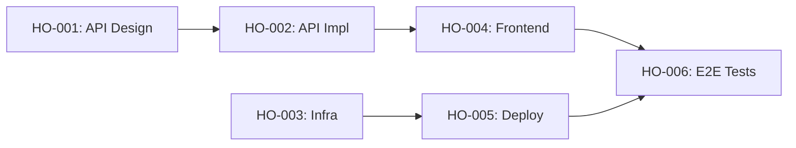

# Handoff Protocol Skill

This skill defines the standard protocol for handing off work between different LLM sessions or agents. It ensures continuity, quality verification, and proper tracking when work transitions from one agent to another.

## Table of Contents

1. [Handoff Document Structure](#handoff-document-structure)
2. [When to Create Handoffs](#when-to-create-handoffs)
3. [Handoff Verification Protocol](#handoff-verification-protocol)
4. [Rollback Protocol](#rollback-protocol)
5. [Handoff Chain Tracking](#handoff-chain-tracking)
6. [Git Commit Strategy](#git-commit-strategy)
7. [External LLM Communication Template](#external-llm-communication-template)
8. [Handoff Lifecycle States](#handoff-lifecycle-states)
9. [Best Practices](#best-practices)

---

## Handoff Document Structure

Every handoff MUST use this standardized format:

```markdown
# Handoff: [Source Agent] → [Target Agent]

## Handoff ID: HO-XXX
## Date: YYYY-MM-DD
## Status: PENDING | IN_PROGRESS | COMPLETED | BLOCKED

## Context Summary
[Brief summary of work completed - 2-3 sentences max]
[Reference to original task/issue if applicable]

## Deliverables
- [ ] File: path/to/file.ts - [description of what this file does]
- [ ] File: path/to/another.ts - [description of what this file does]
- [ ] Test: path/to/test.spec.ts - [what tests were added]

## API Contracts to Follow
[Reference to api-contracts.md section or inline contract definition]

Example:
- Endpoint: POST /api/users
- Request: { name: string, email: string }
- Response: { id: string, name: string, email: string, createdAt: string }

## Dependencies
- Requires: HO-001, HO-002 (must be completed before this handoff can start)
- Blocks: HO-005, HO-006 (these handoffs wait for this one)

## Quality Checklist
- [ ] All tests pass (`npm test` or equivalent)
- [ ] No lint errors (`npm run lint`)
- [ ] Types are correct (no TypeScript errors)
- [ ] Documentation updated (inline comments, JSDoc)
- [ ] No console.log/debug statements left
- [ ] Error handling in place
- [ ] Edge cases considered

## Notes for Next Agent
[Any gotchas, decisions made, things to watch out for]
[Unresolved questions that need answers]
[Technical debt introduced (if any) and why]

## Verification
- [ ] Code reviewed by orchestrator or peer agent
- [ ] Handoff approved by orchestrator
- [ ] Git commit created with handoff reference
```

---

## When to Create Handoffs

### Create a Handoff AFTER:

1. **Completing a unit of work** - A logical chunk that can stand alone
   - Example: Finished the authentication module API endpoints
   - Example: Completed database schema and migrations

2. **Reaching a defined milestone** - From Phase 3 planning
   - Example: All CRUD endpoints for User entity complete
   - Example: Frontend component library scaffolded

3. **Before switching context** - When you need another agent to continue
   - Example: Backend API done, frontend agent can now consume it
   - Example: Core logic complete, testing agent can verify

4. **At natural boundaries** - When work logically separates
   - Example: Data layer complete, service layer can begin
   - Example: Shared types defined, multiple agents can parallelize

5. **When blocked** - Document what's blocking and hand off for resolution
   - Example: Need environment variable that only DevOps agent can provide
   - Example: Waiting for API response format decision from architect

### DO NOT Create a Handoff When:

- Work is half-finished with broken tests
- You're just pausing temporarily (use state save instead)
- Changes are trivial (single typo fix)
- The next step is still your responsibility

---

## Handoff Verification Protocol

### Before ACCEPTING a Handoff (Receiving Agent):

```
┌─────────────────────────────────────────────────────────────┐
│                  HANDOFF VERIFICATION CHECKLIST             │
├─────────────────────────────────────────────────────────────┤
│  1. [ ] Read the handoff document completely                │
│  2. [ ] Verify all listed files exist                       │
│  3. [ ] Run the test suite - all tests must pass            │
│  4. [ ] Run linter - no errors allowed                      │
│  5. [ ] Check TypeScript compilation - no type errors       │
│  6. [ ] Review API contracts match implementation           │
│  7. [ ] Verify dependencies (HO-XXX) are marked COMPLETED   │
│  8. [ ] Understand the "Notes for Next Agent" section       │
│  9. [ ] Check git history - handoff commit exists           │
│ 10. [ ] Confirm you can run/test the delivered code         │
└─────────────────────────────────────────────────────────────┘
```

### Verification Commands (Run These):

```bash
# 1. Pull latest and checkout handoff branch
git pull origin main
git checkout handoff/HO-XXX

# 2. Install dependencies (if changed)
npm install  # or yarn, pnpm

# 3. Run tests
npm test

# 4. Run linter
npm run lint

# 5. Type check
npm run typecheck  # or tsc --noEmit

# 6. Try to start/build
npm run build
npm run dev  # if applicable
```

### If Verification FAILS:

1. **DO NOT proceed** with your work
2. Mark handoff as `BLOCKED`
3. Document what failed:
   ```markdown
   ## Verification Failed
   - Issue: Tests failing in auth.spec.ts
   - Error: `Expected 200, received 401`
   - Action: Returned to HO-003 source agent
   ```
4. Notify orchestrator or source agent
5. Wait for resolution before continuing

### If Verification PASSES:

1. Mark handoff as `IN_PROGRESS`
2. Create your working branch from the handoff
3. Proceed with assigned tasks
4. Reference handoff ID in your work

---

## Rollback Protocol

### When to Rollback:

- Handoff introduced breaking changes discovered later
- Integration revealed incompatible implementations
- Critical bug found in handed-off code
- API contract was violated

### Rollback Steps:

```
┌─────────────────────────────────────────────────────────────┐
│                     ROLLBACK PROTOCOL                       │
├─────────────────────────────────────────────────────────────┤
│                                                             │
│  1. STOP all dependent work immediately                     │
│                                                             │
│  2. DOCUMENT the issue:                                     │
│     - What broke                                            │
│     - When discovered                                       │
│     - Impact assessment                                     │
│                                                             │
│  3. GIT ROLLBACK (choose appropriate method):               │
│                                                             │
│     Option A - Revert commit (safe, preserves history):     │
│     $ git revert <handoff-commit-hash>                      │
│                                                             │
│     Option B - Reset to pre-handoff (if not pushed):        │
│     $ git reset --hard <pre-handoff-commit>                 │
│                                                             │
│  4. UPDATE handoff status to BLOCKED                        │
│                                                             │
│  5. NOTIFY all affected agents/handoffs                     │
│                                                             │
│  6. CREATE fix task assigned to original source agent       │
│                                                             │
│  7. WAIT for fixed handoff before resuming                  │
│                                                             │
└─────────────────────────────────────────────────────────────┘
```

### Rollback Document Template:

```markdown
# Rollback Notice: HO-XXX

## Initiated By: [Agent Name]
## Date: YYYY-MM-DD
## Severity: CRITICAL | HIGH | MEDIUM

## Issue Description
[What went wrong]

## Affected Components
- File: path/to/broken.ts
- Handoffs blocked: HO-005, HO-006

## Root Cause
[Why it happened]

## Rollback Actions Taken
- Reverted commit: abc123
- Reset branch to: xyz789

## Fix Requirements
[What needs to be fixed before re-handoff]

## Assigned To
[Agent responsible for fix]
```

---

## Handoff Chain Tracking

### Handoff Registry Structure

Maintain a central handoff registry file: `.handoffs/registry.md`

```markdown
# Handoff Registry

## Active Handoffs

| ID     | Source → Target     | Status      | Depends On | Blocks    | Date       |
|--------|---------------------|-------------|------------|-----------|------------|
| HO-001 | Architect → Backend | COMPLETED   | -          | HO-002    | 2025-01-15 |
| HO-002 | Backend → Frontend  | IN_PROGRESS | HO-001     | HO-004    | 2025-01-16 |
| HO-003 | Architect → DevOps  | PENDING     | -          | HO-005    | 2025-01-16 |
| HO-004 | Frontend → Testing  | PENDING     | HO-002     | HO-006    | -          |

## Dependency Graph



## Completed Handoffs Archive
[Move completed handoffs here with completion date]
```

### Chain Validation Rules:

1. **No circular dependencies** - A cannot depend on B if B depends on A
2. **All dependencies resolved** - Cannot start HO-XXX if its "Requires" are not COMPLETED
3. **Block propagation** - If HO-001 is BLOCKED, all that depend on it become BLOCKED
4. **Single active** - An agent should have only one IN_PROGRESS handoff at a time

### Viewing the Chain:

```bash
# Generate visual dependency graph
cat .handoffs/registry.md | grep -A 20 "Dependency Graph"

# Check specific handoff status
grep "HO-003" .handoffs/registry.md

# List all blocked handoffs
grep "BLOCKED" .handoffs/registry.md
```

---

## Git Commit Strategy

### Branch Naming Convention:

```
handoff/HO-XXX-brief-description
```

Examples:
- `handoff/HO-001-api-design`
- `handoff/HO-002-user-crud-endpoints`
- `handoff/HO-003-auth-middleware`

### Commit Message Format:

```
[HO-XXX] Brief description of changes

- Detailed point 1
- Detailed point 2

Handoff: Source Agent → Target Agent
Status: READY_FOR_HANDOFF
Depends: HO-001, HO-002
Blocks: HO-005
```

### Git Workflow at Handoff Points:

```bash
# 1. Ensure clean state
git status  # Should show no uncommitted changes

# 2. Run all checks
npm test && npm run lint && npm run typecheck

# 3. Create handoff commit
git add .
git commit -m "[HO-XXX] Complete user authentication module

- Added JWT token generation and validation
- Implemented refresh token rotation
- Added auth middleware for protected routes
- Unit tests for all auth functions

Handoff: Backend Agent → Frontend Agent
Status: READY_FOR_HANDOFF
Depends: HO-001
Blocks: HO-004, HO-005"

# 4. Tag the handoff point (optional but recommended)
git tag handoff-HO-XXX

# 5. Push to remote
git push origin handoff/HO-XXX
git push --tags

# 6. Update handoff document status to PENDING
```

### Merge Strategy:

```
main
  │
  ├── handoff/HO-001-api-design ──────► merge to main when COMPLETED
  │     │
  │     └── handoff/HO-002-backend ───► merge to main when COMPLETED
  │           │
  │           └── handoff/HO-004-frontend ──► merge to main when COMPLETED
```

---

## External LLM Communication Template

When handing off to an external LLM (different session, different model), provide this structured context:

### Template for External LLM Handoff:

```markdown
# Project Handoff Context

## Project Overview
[2-3 sentence project description]
Tech Stack: [list technologies]
Repository: [repo URL if applicable]

## Your Assignment
You are taking over as the [Role] agent for this project.
Your task: [specific task description]

## Handoff Reference
Handoff ID: HO-XXX
Previous Agent: [Source Agent type/name]
Your Role: [Target Agent type/name]

## Files to Focus On
Priority files (read these first):
1. `path/to/main/file.ts` - [why important]
2. `path/to/types.ts` - [shared types]
3. `path/to/api-contracts.md` - [API specifications]

## API Contracts You MUST Follow
[Copy relevant API contracts here or reference file]

```typescript
// Example: User API Contract
interface CreateUserRequest {
  name: string;
  email: string;
}

interface CreateUserResponse {
  id: string;
  name: string;
  email: string;
  createdAt: string;
}
```

## Decisions Already Made (DO NOT CHANGE)
- Decision 1: [what was decided and why]
- Decision 2: [what was decided and why]

## Your Deliverables
- [ ] Deliverable 1: [specific file/feature]
- [ ] Deliverable 2: [specific file/feature]

## Quality Requirements
- All tests must pass
- No lint errors
- TypeScript strict mode
- Follow existing code patterns

## When You're Done
1. Run: `npm test && npm run lint && npm run typecheck`
2. Create handoff document using template in `.handoffs/template.md`
3. Commit with message format: `[HO-XXX] description`
4. Update `.handoffs/registry.md`

## Questions to Ask If Unclear
Before making assumptions, ask about:
- [Potential ambiguity 1]
- [Potential ambiguity 2]

## Notes and Gotchas
- Gotcha 1: [something to watch out for]
- Gotcha 2: [technical detail that's not obvious]
```

### Minimal Context Version (for token-limited LLMs):

```markdown
# Handoff: HO-XXX

Task: [one-line description]
Stack: [tech stack]
Files: [3-5 key files]

Must Follow:
- API: [endpoint] expects [input] returns [output]
- Pattern: [coding pattern to follow]

Deliver:
- [ ] [deliverable 1]
- [ ] [deliverable 2]

Run before done: npm test && npm run lint
```

---

## Handoff Lifecycle States

```
┌──────────┐     ┌─────────────┐     ┌───────────┐     ┌───────────┐
│ PENDING  │ ──► │ IN_PROGRESS │ ──► │ COMPLETED │     │  BLOCKED  │
└──────────┘     └─────────────┘     └───────────┘     └───────────┘
     │                  │                                     ▲
     │                  │                                     │
     │                  └─────────────────────────────────────┘
     │                        (verification failed)
     │
     └────────────────────────────────────────────────────────┘
                   (dependency blocked)
```

### State Definitions:

| State | Meaning | Actions Allowed |
|-------|---------|-----------------|
| PENDING | Work complete, awaiting pickup | Target agent can accept |
| IN_PROGRESS | Target agent actively working | Only assigned agent works |
| COMPLETED | Work done and verified | Can be archived |
| BLOCKED | Issue preventing progress | Requires resolution |

### State Transitions:

- `PENDING → IN_PROGRESS`: Target agent accepts and verifies handoff
- `IN_PROGRESS → COMPLETED`: All deliverables done, tests pass
- `IN_PROGRESS → BLOCKED`: Issue discovered during work
- `PENDING → BLOCKED`: Dependency handoff failed
- `BLOCKED → PENDING`: Issue resolved, ready for retry

---

## Best Practices

### DO:

1. **Be explicit** - Don't assume the receiving agent knows context
2. **Test before handoff** - Never hand off broken code
3. **Document decisions** - Explain WHY, not just WHAT
4. **Keep handoffs small** - Prefer multiple small handoffs over one large
5. **Update registry immediately** - Keep `.handoffs/registry.md` current
6. **Tag git commits** - Makes rollback easier
7. **Include runnable examples** - Help receiving agent understand quickly

### DON'T:

1. **Don't hand off incomplete work** - Finish the unit or don't hand off
2. **Don't skip verification** - Always run tests before accepting
3. **Don't ignore blockers** - Address immediately, don't work around
4. **Don't break API contracts** - They are agreements, not suggestions
5. **Don't assume capabilities** - Research the target LLM if external
6. **Don't leave debug code** - Clean up before handoff
7. **Don't create circular dependencies** - Plan the chain carefully

### Handoff Checklist (Copy for Each Handoff):

```markdown
## Pre-Handoff Checklist (Source Agent)
- [ ] All assigned tasks complete
- [ ] Tests written and passing
- [ ] Lint check passes
- [ ] Type check passes
- [ ] Code reviewed (self or peer)
- [ ] Handoff document created
- [ ] API contracts documented
- [ ] Git commit with handoff ID
- [ ] Registry updated
- [ ] Notes for next agent written

## Post-Acceptance Checklist (Target Agent)
- [ ] Handoff document read completely
- [ ] All files verified to exist
- [ ] Tests run and pass
- [ ] Lint check passes
- [ ] Type check passes
- [ ] Dependencies confirmed complete
- [ ] Questions clarified before starting
- [ ] Status updated to IN_PROGRESS
```

---

## Quick Reference Card

```
┌─────────────────────────────────────────────────────────────┐
│                  HANDOFF QUICK REFERENCE                    │
├─────────────────────────────────────────────────────────────┤
│                                                             │
│  CREATE HANDOFF:                                            │
│  1. Finish work unit                                        │
│  2. Run: npm test && npm run lint                           │
│  3. Write handoff doc in .handoffs/HO-XXX.md                │
│  4. Commit: git commit -m "[HO-XXX] description"            │
│  5. Update .handoffs/registry.md                            │
│  6. Set status: PENDING                                     │
│                                                             │
│  ACCEPT HANDOFF:                                            │
│  1. Read handoff doc completely                             │
│  2. Verify files exist                                      │
│  3. Run: npm test && npm run lint                           │
│  4. Check dependencies are COMPLETED                        │
│  5. Set status: IN_PROGRESS                                 │
│  6. Begin work                                              │
│                                                             │
│  COMPLETE HANDOFF:                                          │
│  1. Finish all deliverables                                 │
│  2. Run: npm test && npm run lint                           │
│  3. Create your handoff doc                                 │
│  4. Set previous: COMPLETED                                 │
│  5. Set yours: PENDING                                      │
│                                                             │
│  ROLLBACK:                                                  │
│  1. Stop all dependent work                                 │
│  2. git revert <commit>                                     │
│  3. Set status: BLOCKED                                     │
│  4. Document issue                                          │
│  5. Notify orchestrator                                     │
│                                                             │
└─────────────────────────────────────────────────────────────┘
```
