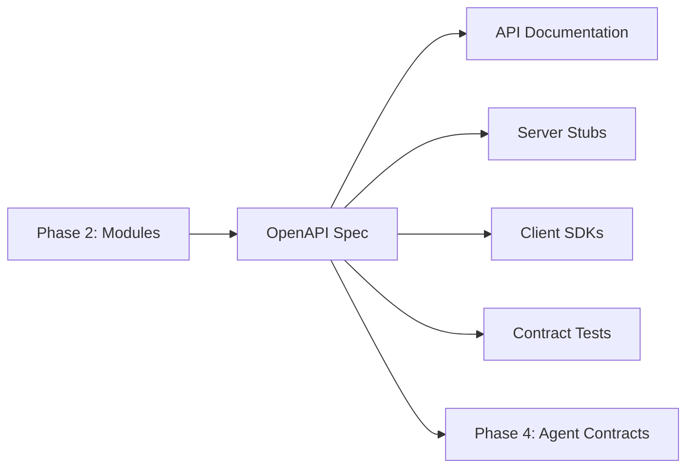
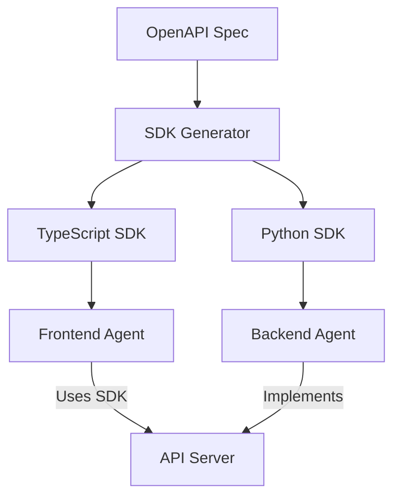

# OpenAPI Specification Generation for Framework Development

This skill provides templates and guidance for generating OpenAPI 3.1 specifications during Phase 3 (Planning). OpenAPI specs serve as the single source of truth for API contracts, enabling code generation, documentation, and contract testing.

## OpenAPI in Framework Development



## OpenAPI 3.1 Template

```yaml
openapi: 3.1.0

info:
  title: [Project Name] API
  description: |
    API specification for [Project Name].

    ## Overview
    [Brief description of what this API does]

    ## Authentication
    [How to authenticate]

    ## Rate Limiting
    [Rate limit policies]
  version: 1.0.0
  contact:
    name: API Support
    email: api@example.com
  license:
    name: MIT
    url: https://opensource.org/licenses/MIT

servers:
  - url: https://api.example.com/v1
    description: Production
  - url: https://staging-api.example.com/v1
    description: Staging
  - url: http://localhost:3000/v1
    description: Development

tags:
  - name: Tasks
    description: Task management operations
  - name: Projects
    description: Project management operations
  - name: Users
    description: User management operations

security:
  - bearerAuth: []

paths:
  # Paths defined below

components:
  securitySchemes:
    bearerAuth:
      type: http
      scheme: bearer
      bearerFormat: JWT

  schemas:
    # Schemas defined below

  responses:
    # Reusable responses

  parameters:
    # Reusable parameters
```

## Resource Definition Template

For each resource identified in Phase 2:

```yaml
paths:
  /tasks:
    get:
      operationId: listTasks
      summary: List all tasks
      description: |
        Retrieves a paginated list of tasks.
        Supports filtering by status, priority, and assignee.
      tags:
        - Tasks
      parameters:
        - $ref: '#/components/parameters/PageParam'
        - $ref: '#/components/parameters/LimitParam'
        - name: status
          in: query
          schema:
            $ref: '#/components/schemas/TaskStatus'
        - name: priority
          in: query
          schema:
            $ref: '#/components/schemas/Priority'
        - name: assigneeId
          in: query
          schema:
            type: string
            format: uuid
      responses:
        '200':
          description: Successful response
          content:
            application/json:
              schema:
                $ref: '#/components/schemas/TaskListResponse'
        '401':
          $ref: '#/components/responses/Unauthorized'
        '429':
          $ref: '#/components/responses/RateLimited'

    post:
      operationId: createTask
      summary: Create a new task
      description: Creates a new task in the specified project.
      tags:
        - Tasks
      requestBody:
        required: true
        content:
          application/json:
            schema:
              $ref: '#/components/schemas/CreateTaskRequest'
            examples:
              basic:
                summary: Basic task
                value:
                  title: Implement login
                  projectId: proj-123
              full:
                summary: Full task with all fields
                value:
                  title: Implement login
                  description: Add OAuth2 login flow
                  projectId: proj-123
                  assigneeId: user-456
                  priority: high
                  dueDate: '2025-02-15'
      responses:
        '201':
          description: Task created
          content:
            application/json:
              schema:
                $ref: '#/components/schemas/TaskResponse'
        '400':
          $ref: '#/components/responses/BadRequest'
        '401':
          $ref: '#/components/responses/Unauthorized'
        '422':
          $ref: '#/components/responses/ValidationError'

  /tasks/{taskId}:
    parameters:
      - name: taskId
        in: path
        required: true
        schema:
          type: string
          format: uuid
        description: Unique task identifier

    get:
      operationId: getTask
      summary: Get a task by ID
      tags:
        - Tasks
      responses:
        '200':
          description: Successful response
          content:
            application/json:
              schema:
                $ref: '#/components/schemas/TaskResponse'
        '401':
          $ref: '#/components/responses/Unauthorized'
        '404':
          $ref: '#/components/responses/NotFound'

    put:
      operationId: updateTask
      summary: Update a task
      tags:
        - Tasks
      requestBody:
        required: true
        content:
          application/json:
            schema:
              $ref: '#/components/schemas/UpdateTaskRequest'
      responses:
        '200':
          description: Task updated
          content:
            application/json:
              schema:
                $ref: '#/components/schemas/TaskResponse'
        '401':
          $ref: '#/components/responses/Unauthorized'
        '404':
          $ref: '#/components/responses/NotFound'
        '422':
          $ref: '#/components/responses/ValidationError'

    delete:
      operationId: deleteTask
      summary: Delete a task
      tags:
        - Tasks
      responses:
        '204':
          description: Task deleted
        '401':
          $ref: '#/components/responses/Unauthorized'
        '404':
          $ref: '#/components/responses/NotFound'
```

## Schema Definitions

```yaml
components:
  schemas:
    # Enums
    TaskStatus:
      type: string
      enum: [todo, in_progress, in_review, done]
      description: Current status of the task

    Priority:
      type: string
      enum: [low, medium, high, urgent]
      description: Task priority level

    # Core Resource
    Task:
      type: object
      required:
        - id
        - title
        - status
        - projectId
        - createdAt
        - updatedAt
      properties:
        id:
          type: string
          format: uuid
          readOnly: true
        title:
          type: string
          minLength: 3
          maxLength: 200
        description:
          type: string
          maxLength: 5000
        status:
          $ref: '#/components/schemas/TaskStatus'
        priority:
          $ref: '#/components/schemas/Priority'
          default: medium
        projectId:
          type: string
          format: uuid
        assigneeId:
          type: string
          format: uuid
          nullable: true
        dueDate:
          type: string
          format: date
          nullable: true
        createdAt:
          type: string
          format: date-time
          readOnly: true
        updatedAt:
          type: string
          format: date-time
          readOnly: true

    # Request Schemas
    CreateTaskRequest:
      type: object
      required:
        - title
        - projectId
      properties:
        title:
          type: string
          minLength: 3
          maxLength: 200
        description:
          type: string
          maxLength: 5000
        priority:
          $ref: '#/components/schemas/Priority'
        projectId:
          type: string
          format: uuid
        assigneeId:
          type: string
          format: uuid
        dueDate:
          type: string
          format: date

    UpdateTaskRequest:
      type: object
      properties:
        title:
          type: string
          minLength: 3
          maxLength: 200
        description:
          type: string
          maxLength: 5000
        status:
          $ref: '#/components/schemas/TaskStatus'
        priority:
          $ref: '#/components/schemas/Priority'
        assigneeId:
          type: string
          format: uuid
          nullable: true
        dueDate:
          type: string
          format: date
          nullable: true

    # Response Wrappers
    TaskResponse:
      type: object
      properties:
        data:
          $ref: '#/components/schemas/Task'

    TaskListResponse:
      type: object
      properties:
        data:
          type: array
          items:
            $ref: '#/components/schemas/Task'
        meta:
          $ref: '#/components/schemas/PaginationMeta'

    # Pagination
    PaginationMeta:
      type: object
      properties:
        totalCount:
          type: integer
        page:
          type: integer
        limit:
          type: integer
        totalPages:
          type: integer

    # Errors
    Error:
      type: object
      required:
        - code
        - message
      properties:
        code:
          type: string
        message:
          type: string
        details:
          type: object
          additionalProperties: true

    ValidationError:
      type: object
      properties:
        errors:
          type: array
          items:
            type: object
            properties:
              field:
                type: string
              message:
                type: string
              code:
                type: string
```

## Reusable Components

```yaml
components:
  parameters:
    PageParam:
      name: page
      in: query
      schema:
        type: integer
        minimum: 1
        default: 1
      description: Page number for pagination

    LimitParam:
      name: limit
      in: query
      schema:
        type: integer
        minimum: 1
        maximum: 100
        default: 20
      description: Number of items per page

    SortParam:
      name: sort
      in: query
      schema:
        type: string
      description: |
        Sort field and direction.
        Prefix with `-` for descending.
        Example: `-createdAt`

  responses:
    BadRequest:
      description: Bad request
      content:
        application/json:
          schema:
            $ref: '#/components/schemas/Error'
          example:
            code: BAD_REQUEST
            message: Invalid request format

    Unauthorized:
      description: Unauthorized
      content:
        application/json:
          schema:
            $ref: '#/components/schemas/Error'
          example:
            code: UNAUTHORIZED
            message: Invalid or missing authentication token

    Forbidden:
      description: Forbidden
      content:
        application/json:
          schema:
            $ref: '#/components/schemas/Error'
          example:
            code: FORBIDDEN
            message: Insufficient permissions

    NotFound:
      description: Resource not found
      content:
        application/json:
          schema:
            $ref: '#/components/schemas/Error'
          example:
            code: NOT_FOUND
            message: Resource not found

    ValidationError:
      description: Validation error
      content:
        application/json:
          schema:
            $ref: '#/components/schemas/ValidationError'
          example:
            errors:
              - field: title
                message: Title must be at least 3 characters
                code: MIN_LENGTH

    RateLimited:
      description: Rate limit exceeded
      headers:
        X-RateLimit-Limit:
          schema:
            type: integer
        X-RateLimit-Remaining:
          schema:
            type: integer
        X-RateLimit-Reset:
          schema:
            type: integer
      content:
        application/json:
          schema:
            $ref: '#/components/schemas/Error'
```

## Validation Commands

Validate OpenAPI specifications before use:

```bash
# Using Spectral (recommended)
npm install -g @stoplight/spectral-cli
spectral lint openapi.yaml

# Using OpenAPI Generator
npm install -g @openapitools/openapi-generator-cli
openapi-generator-cli validate -i openapi.yaml

# Using Swagger CLI
npm install -g swagger-cli
swagger-cli validate openapi.yaml
```

### Custom Validation Rules (Spectral)

Create `.spectral.yaml`:

```yaml
extends: spectral:oas
rules:
  operation-operationId:
    severity: error

  operation-tags:
    severity: error

  operation-description:
    severity: warn

  # Custom rule: Require examples
  require-examples:
    description: Responses should have examples
    given: $.paths[*][*].responses[*].content[*]
    then:
      field: examples
      function: truthy
```

## SDK Generation

Generate client SDKs from OpenAPI spec:

```bash
# TypeScript/JavaScript
openapi-generator-cli generate \
  -i openapi.yaml \
  -g typescript-axios \
  -o ./sdk/typescript

# Python
openapi-generator-cli generate \
  -i openapi.yaml \
  -g python \
  -o ./sdk/python

# Go
openapi-generator-cli generate \
  -i openapi.yaml \
  -g go \
  -o ./sdk/go
```

### SDK Generation for Agent Assignment

Generate SDKs that different agents can use:



## Server Stub Generation

Generate server stubs for backend implementation:

```bash
# Node.js/Express
openapi-generator-cli generate \
  -i openapi.yaml \
  -g nodejs-express-server \
  -o ./server

# Python/FastAPI
openapi-generator-cli generate \
  -i openapi.yaml \
  -g python-fastapi \
  -o ./server

# Go/Gin
openapi-generator-cli generate \
  -i openapi.yaml \
  -g go-gin-server \
  -o ./server
```

## Phase 3 Integration Workflow

1. **Gather Requirements**
   - List all resources from Phase 2
   - Document relationships between resources
   - Define authentication requirements
   - Specify validation rules

2. **Create Base Spec**
   - Define info, servers, security
   - Create tag structure
   - Set up reusable components

3. **Define Resources**
   - For each resource: CRUD paths
   - Document parameters and schemas
   - Add request/response examples

4. **Validate Spec**
   - Run Spectral linting
   - Validate with OpenAPI tools
   - Review for completeness

5. **Generate Artifacts**
   - API documentation
   - Server stubs (if applicable)
   - Client SDKs

6. **Prepare for Phase 4**
   - Document which endpoints each agent owns
   - Create contract test templates
   - Define integration points

## Documentation Generation

Generate interactive documentation:

```bash
# Redoc
npx @redocly/cli build-docs openapi.yaml -o docs/index.html

# Swagger UI
docker run -p 8080:8080 \
  -e SWAGGER_JSON=/api/openapi.yaml \
  -v $(pwd):/api \
  swaggerapi/swagger-ui
```

## OpenAPI Specification Checklist

Before finalizing for Phase 4:

- [ ] All resources from Phase 2 have CRUD endpoints
- [ ] Authentication requirements documented
- [ ] All request bodies have schemas
- [ ] All responses have schemas
- [ ] Validation constraints in schemas (min, max, pattern)
- [ ] Error responses defined consistently
- [ ] Pagination implemented for list endpoints
- [ ] Examples provided for all operations
- [ ] operationId set for all operations
- [ ] Tags organize endpoints logically
- [ ] Spec passes validation (Spectral, OpenAPI validator)
- [ ] SDK generation tested successfully

## Connecting to Agent Assignment

In Phase 4, the OpenAPI spec becomes the contract:

```markdown
## Agent Assignment Contract

### Backend Agent
- Implements all endpoints in openapi.yaml
- Must pass contract tests
- Validates against schemas

### Frontend Agent
- Consumes generated TypeScript SDK
- Handles errors per spec
- Uses types from SDK

### QA Agent
- Generates contract tests from spec
- Validates request/response formats
- Tests error scenarios
```

## File Organization

```
project/
  docs/
    api/
      openapi.yaml           # Main spec
      paths/
        tasks.yaml           # Task paths (optional split)
        projects.yaml        # Project paths
      schemas/
        task.yaml            # Task schemas
        project.yaml         # Project schemas
  sdk/
    typescript/              # Generated SDK
    python/                  # Generated SDK
  tests/
    contract/                # Contract tests
```

## Splitting Large Specs

For large APIs, split into multiple files:

```yaml
# openapi.yaml
openapi: 3.1.0
info:
  title: My API
paths:
  $ref: './paths/index.yaml'
components:
  schemas:
    $ref: './schemas/index.yaml'

# paths/index.yaml
/tasks:
  $ref: './tasks.yaml#/tasks'
/tasks/{id}:
  $ref: './tasks.yaml#/task'
```
