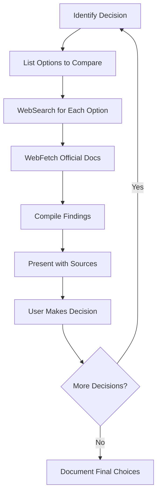

# Research Workflow Skill

This skill teaches the framework-developer agent how to research technology choices with proper sources and citations. Use this skill when evaluating technology options, comparing frameworks, or making architectural decisions.

---

## Core Principles

### 1. NEVER Hallucinate
- Every technology claim must have a verifiable source
- If you cannot find a source, explicitly state "I could not verify this"
- Outdated information is worse than no information

### 2. Sources First, Opinion Second
- Research before forming recommendations
- Present raw findings, then analysis
- Let the user see the evidence

### 3. Balanced Presentation
- Every option deserves fair evaluation
- Acknowledge tradeoffs honestly
- Highlight what matters for the user's specific context

---

## Research Flow

```
1. Identify Decision → What choice needs to be made?
2. List Options     → What are the realistic candidates?
3. Search Each      → Use WebSearch for each option
4. Fetch Docs       → Use WebFetch for official documentation
5. Present Findings → Format with pros/cons and sources
6. User Decides     → Never make the decision for them
```

### Mermaid Diagram



---

## Search Strategy

### Effective Search Queries

| Goal | Search Query Pattern |
|------|---------------------|
| Comparison | `"[Option A] vs [Option B] 2025 comparison"` |
| Official docs | `"[Technology] official documentation"` |
| Use cases | `"[Technology] best use cases when to use"` |
| Performance | `"[Technology] benchmarks performance 2025"` |
| Limitations | `"[Technology] limitations drawbacks problems"` |
| Security | `"[Technology] security vulnerabilities CVE"` |
| Community | `"[Technology] community size npm downloads github stars"` |
| Migration | `"[Technology] migration guide from [Other]"` |

### Best Sources to Search

**Tier 1 - Official Sources (Most Reliable)**
- Official documentation sites
- GitHub repositories (stars, issues, last commit)
- Official blog posts/announcements

**Tier 2 - Technical Authority**
- Stack Overflow (trending questions, vote counts)
- Tech blogs (Vercel, Netlify, AWS, etc.)
- Conference talks (YouTube, official conferences)

**Tier 3 - Community & Benchmarks**
- State of JS/CSS/HTML surveys
- TechEmpower benchmarks
- npm trends / bundlephobia
- Reddit (r/webdev, r/node, r/programming)

**Tier 4 - Supporting Context**
- Medium articles (verify author credibility)
- Dev.to articles
- Personal blogs of known experts

---

## Technology-Specific Research Questions

### Databases

| Question | Why It Matters |
|----------|---------------|
| What data model fits your needs? | Relational vs Document vs Graph vs Key-Value |
| What's your read/write ratio? | Affects index strategy and caching |
| Do you need ACID transactions? | PostgreSQL/MySQL vs MongoDB/DynamoDB |
| What's your scaling requirement? | Vertical vs Horizontal scaling |
| What's your team's expertise? | Familiarity reduces bugs |
| What's the hosting cost at scale? | RDS vs PlanetScale vs Supabase pricing |

**Key Sources to Check:**
- Official docs: postgresql.org, mongodb.com/docs, redis.io
- DB-Engines ranking: db-engines.com/en/ranking
- Benchmarks: TechEmpower, sysbench results

**Example Research Session:**
```
User: "Should I use PostgreSQL or MongoDB for my e-commerce app?"

Research Steps:
1. WebSearch: "PostgreSQL vs MongoDB e-commerce 2025"
2. WebSearch: "PostgreSQL e-commerce best practices"
3. WebSearch: "MongoDB e-commerce use cases"
4. WebFetch: https://www.postgresql.org/docs/current/index.html
5. WebFetch: https://www.mongodb.com/docs/manual/
```

---

### Frontend Frameworks

| Question | Why It Matters |
|----------|---------------|
| What's your rendering strategy? | SPA vs SSR vs SSG vs ISR |
| Do you need SEO? | SSR/SSG required for SEO |
| What's your bundle size tolerance? | React vs Preact vs Svelte |
| What's your team size? | Larger teams benefit from React/Angular structure |
| Do you need mobile too? | React Native, Flutter consideration |
| What's your interactivity level? | Content site vs app-like experience |

**Key Sources to Check:**
- Official docs: react.dev, vuejs.org, svelte.dev, angular.io
- Bundle sizes: bundlephobia.com
- Surveys: stateofjs.com
- npm trends: npmtrends.com

**Example Research Session:**
```
User: "React vs Vue vs Svelte for a dashboard app?"

Research Steps:
1. WebSearch: "React vs Vue vs Svelte 2025 comparison dashboard"
2. WebSearch: "React dashboard best practices"
3. WebSearch: "Vue dashboard ecosystem"
4. WebSearch: "Svelte enterprise adoption"
5. Check npm trends for download comparison
6. Check State of JS satisfaction scores
```

---

### Backend Frameworks

| Question | Why It Matters |
|----------|---------------|
| What language is your team comfortable with? | Node, Python, Go, Rust, Java |
| What's your performance requirement? | Express vs Fastify, Django vs FastAPI |
| Do you need real-time features? | WebSocket support varies |
| What's your API style? | REST vs GraphQL vs tRPC |
| Microservices or monolith? | Framework ecosystem matters |
| Serverless or traditional? | Lambda/Cloud Functions compatibility |

**Key Sources to Check:**
- Official docs: expressjs.com, fastify.io, djangoproject.com, fastapi.tiangolo.com
- Benchmarks: techempower.com/benchmarks
- GitHub: stars, issues, release frequency

**Example Research Session:**
```
User: "Express vs Fastify vs Hono for a REST API?"

Research Steps:
1. WebSearch: "Express vs Fastify vs Hono benchmark 2025"
2. WebSearch: "Fastify production use cases"
3. WebSearch: "Hono cloudflare workers performance"
4. WebFetch TechEmpower benchmarks
5. Check GitHub issues/activity for each
```

---

### Cloud Providers

| Question | Why It Matters |
|----------|---------------|
| What's your budget? | AWS vs GCP vs Azure vs smaller providers |
| Where are your users located? | Region availability |
| Do you need managed services? | RDS, Cloud SQL, Aurora |
| What's your compliance requirement? | HIPAA, SOC2, GDPR |
| Do you have existing infrastructure? | Migration complexity |
| What's your team's expertise? | Learning curve consideration |

**Key Sources to Check:**
- Official pricing pages
- Cloud comparison sites: cloudcompare.net
- Status pages for reliability history
- Compliance documentation

**Example Research Session:**
```
User: "AWS vs Vercel for hosting a Next.js app?"

Research Steps:
1. WebSearch: "AWS vs Vercel Next.js hosting 2025"
2. WebSearch: "Vercel pricing at scale"
3. WebSearch: "AWS Amplify Next.js deployment"
4. WebFetch: Vercel pricing page
5. WebFetch: AWS Amplify pricing page
6. Compare feature sets for specific needs
```

---

### State Management

| Question | Why It Matters |
|----------|---------------|
| How complex is your state? | Local state vs global store |
| Do you need server state caching? | React Query, SWR, RTK Query |
| What's your debugging preference? | Redux DevTools availability |
| Do you need persistence? | localStorage, IndexedDB integration |
| What's your bundle size tolerance? | Redux Toolkit vs Zustand vs Jotai |

**Key Sources to Check:**
- Official docs: redux.js.org, zustand docs, jotai.org
- npm trends comparison
- Bundle size comparison

**Example Research Session:**
```
User: "Redux Toolkit vs Zustand vs Jotai?"

Research Steps:
1. WebSearch: "Redux Toolkit vs Zustand vs Jotai 2025"
2. WebSearch: "Zustand vs Jotai when to use"
3. Check bundle sizes on bundlephobia
4. Check npm downloads for adoption
5. Review GitHub discussions for common issues
```

---

### Authentication Systems

| Question | Why It Matters |
|----------|---------------|
| Self-hosted or managed? | Auth0, Clerk vs NextAuth, Lucia |
| What providers do you need? | OAuth (Google, GitHub), Magic links, SMS |
| Do you need enterprise SSO? | SAML, OIDC support |
| What's your security requirement? | MFA, passwordless options |
| What's your budget? | Free tier limits matter at scale |

**Key Sources to Check:**
- Official docs: auth0.com, clerk.com, authjs.dev
- Security advisories for each option
- Pricing calculators

**Example Research Session:**
```
User: "Auth0 vs Clerk vs NextAuth?"

Research Steps:
1. WebSearch: "Auth0 vs Clerk vs NextAuth comparison 2025"
2. WebSearch: "NextAuth security best practices"
3. WebSearch: "Clerk pricing at scale"
4. WebFetch: Auth0 pricing page
5. Check for recent security issues
```

---

## Presentation Template

When presenting research findings, use this format:

```markdown
## [Decision Title]

**Context:** [Brief description of what we're deciding]

### Options Evaluated

| Criteria | Option A | Option B | Option C |
|----------|----------|----------|----------|
| Performance | [finding] | [finding] | [finding] |
| Learning curve | [finding] | [finding] | [finding] |
| Community | [finding] | [finding] | [finding] |
| Cost | [finding] | [finding] | [finding] |
| [Custom] | [finding] | [finding] | [finding] |

### Option A: [Name]

**Official Site:** [URL]

**Pros:**
- [Pro 1] (Source: [URL])
- [Pro 2] (Source: [URL])

**Cons:**
- [Con 1] (Source: [URL])
- [Con 2] (Source: [URL])

**Best For:** [Use case description]

### Option B: [Name]
[Same structure...]

---

### My Analysis

Based on your specific requirements ([list key requirements]):

**Recommended:** [Option] because:
1. [Reason tied to their requirement]
2. [Reason tied to their requirement]

**Caveats:**
- [Important consideration]
- [Risk to be aware of]

**What are your thoughts?**
```

---

## Citation Format

### Inline Citations
```
PostgreSQL supports JSON/JSONB columns natively (Source: postgresql.org/docs/current/datatype-json.html)
```

### Grouped Citations
```
Based on my research:
- Benchmark results show 3x throughput [1]
- Community adoption is growing 40% YoY [2]

Sources:
[1] techempower.com/benchmarks/#section=data-r21
[2] stateofjs.com/en-US/2024/libraries/
```

### When Source is Unavailable
```
Note: I could not find recent benchmarks for this specific comparison.
The most recent data I found is from 2023 (Source: [URL]).
Consider running your own benchmarks for accurate results.
```

---

## Red Flags to Watch For

### Project Health Warning Signs

| Red Flag | How to Check | Concern Level |
|----------|--------------|---------------|
| No commits in 6+ months | GitHub repository | High |
| Many open security issues | GitHub Security tab | Critical |
| Declining npm downloads | npmtrends.com | Medium |
| Abandoned by maintainer | GitHub issues, README | High |
| No TypeScript support | package.json, docs | Medium (context-dependent) |
| Breaking changes frequently | CHANGELOG, GitHub releases | Medium |
| Small bus factor (1 maintainer) | GitHub contributors | Medium |
| No clear migration path | Documentation | High for production |

### Security Red Flags

| Red Flag | How to Check |
|----------|--------------|
| Known CVEs unpatched | Snyk, npm audit, CVE databases |
| Default credentials in docs | Security documentation |
| No security policy | SECURITY.md in repo |
| Outdated dependencies | Dependabot alerts |

### Community Red Flags

| Red Flag | How to Check |
|----------|--------------|
| Unanswered issues pile up | GitHub issues (open vs closed ratio) |
| Toxic community | GitHub discussions, Discord/Slack |
| Documentation is sparse | Official docs site |
| No examples or tutorials | GitHub examples folder, docs |

---

## Evaluating Maturity

### Maturity Assessment Framework

```
Score each 1-5:

1. Documentation Quality
   - Getting started guide exists?
   - API reference complete?
   - Examples provided?
   - Migration guides available?

2. Community Support
   - GitHub stars / npm downloads
   - Stack Overflow questions
   - Discord/Slack activity
   - Conference talks

3. Maintenance Status
   - Last release date
   - Issue response time
   - Security patch cadence
   - Roadmap clarity

4. Production Readiness
   - Companies using in production
   - Case studies available
   - Performance benchmarks
   - Stability guarantees (semver)

5. Ecosystem
   - Plugin/extension ecosystem
   - Third-party tools
   - IDE support
   - Testing utilities

Total: __/25

- 20-25: Production ready, safe choice
- 15-19: Good for most projects, some gaps
- 10-14: Evaluate carefully, may need workarounds
- Below 10: High risk, consider alternatives
```

---

## Example Research Sessions

### Example 1: Database Selection

```
User: "I'm building an e-commerce platform. Should I use PostgreSQL or MongoDB?"

Framework Developer:

Let me research this for your specific use case...

[WebSearch: "PostgreSQL vs MongoDB e-commerce 2025"]
[WebSearch: "PostgreSQL e-commerce schema design"]
[WebSearch: "MongoDB e-commerce use cases limitations"]
[WebFetch: postgresql.org relevant docs]
[WebFetch: mongodb.com relevant docs]

## Database Decision: PostgreSQL vs MongoDB

**Context:** E-commerce platform database selection

### Quick Comparison

| Criteria | PostgreSQL | MongoDB |
|----------|-----------|---------|
| Data relationships | Excellent (JOINs, FK) | Limited ($lookup) |
| Transaction support | Full ACID | ACID (single doc default) |
| Schema flexibility | Structured + JSONB | Fully flexible |
| Performance | Excellent for complex queries | Excellent for reads |
| Hosting options | Many (RDS, Supabase, etc.) | Many (Atlas, self-hosted) |

### PostgreSQL

**Official Docs:** https://postgresql.org/docs/

**Pros:**
- Strong relational model ideal for orders, products, inventory
  (Source: postgresql.org/docs/current/tutorial-join.html)
- ACID transactions critical for payment processing
  (Source: postgresql.org/docs/current/mvcc.html)
- Excellent ecosystem: Prisma, Drizzle, TypeORM support

**Cons:**
- Schema changes require migrations
- Horizontal scaling more complex than MongoDB

**Best For:** E-commerce with complex relationships, inventory management,
reporting needs

### MongoDB

**Official Docs:** https://mongodb.com/docs/manual/

**Pros:**
- Flexible product schemas for varied attributes
  (Source: mongodb.com/docs/manual/core/data-modeling-introduction/)
- Easy horizontal scaling with sharding
  (Source: mongodb.com/docs/manual/sharding/)

**Cons:**
- JOINs ($lookup) less performant than PostgreSQL
- Transaction complexity across collections
  (Source: mongodb.com/docs/manual/core/transactions/)

**Best For:** Product catalogs with varied schemas, high read throughput

---

### My Analysis

For an e-commerce platform, I recommend **PostgreSQL** because:

1. **Order integrity** - E-commerce needs rock-solid ACID transactions
2. **Relationships** - Orders -> Products -> Inventory -> Users
   are highly relational
3. **Reporting** - SQL excels at business analytics queries
4. **Ecosystem** - Supabase, Neon, PlanetScale make hosting easy

**If you have highly variable product attributes**, consider PostgreSQL
with JSONB columns for flexibility within a relational model.

**Caveat:** If you expect massive catalog sizes (millions of products)
with heavy read traffic, MongoDB's sharding might be worth evaluating.

What are your thoughts? Do you have specific requirements around
product schema flexibility?
```

### Example 2: Framework Selection

```
User: "React vs Vue for a team of 3 building an internal dashboard?"

Framework Developer:

Let me research this for your context...

[WebSearch: "React vs Vue internal dashboard 2025"]
[WebSearch: "Vue dashboard ecosystem component libraries"]
[WebSearch: "React dashboard best practices enterprise"]

## Framework Decision: React vs Vue

**Context:** Internal dashboard for team of 3

### Quick Comparison

| Criteria | React | Vue |
|----------|-------|-----|
| Learning curve | Moderate | Gentle |
| Component libraries | Extensive | Good |
| TypeScript support | Excellent | Excellent (Vue 3) |
| Job market | Larger | Growing |
| Bundle size | ~40KB | ~33KB |

### React

**Official Docs:** https://react.dev/

**Pros:**
- Largest ecosystem (Shadcn/ui, Radix, MUI, Chakra)
  (Source: npmtrends.com comparison)
- Most team members likely have exposure
- Excellent dashboard libraries (Tremor, Recharts)

**Cons:**
- More boilerplate for simple tasks
- Decision fatigue (many ways to do things)

### Vue

**Official Docs:** https://vuejs.org/

**Pros:**
- Simpler mental model, faster onboarding
  (Source: vuejs.org/guide/introduction.html)
- Single-file components are clean
- Vuetify, Quasar for dashboards

**Cons:**
- Smaller ecosystem than React
- Fewer pre-built dashboard templates

---

### My Analysis

For a team of 3 building an internal dashboard:

**My lean: Vue** because:
1. **Faster onboarding** - Smaller team benefits from simpler learning
2. **Internal tool** - Ecosystem size matters less
3. **Vuetify** - Excellent for dashboards out of the box

**However, choose React if:**
- Team already knows React
- You want to reuse components in other projects
- Specific library only exists in React ecosystem

**What's your team's current experience with these frameworks?**
```

---

## When Research is Inconclusive

Sometimes research won't yield a clear winner. Handle this honestly:

```markdown
## Research Summary

After researching [Option A] vs [Option B], I found:

**The verdict is context-dependent.** Here's why:

Both options are mature, well-maintained, and used in production.
The "right" choice depends on factors specific to your situation:

| Your Priority | Choose |
|--------------|--------|
| [Priority 1] | Option A |
| [Priority 2] | Option B |
| [Priority 3] | Either works |

**Questions to help you decide:**
1. [Question that would clarify choice]
2. [Question that would clarify choice]
3. [Question that would clarify choice]

**My suggestion:** Let's discuss your specific [priority area] to narrow this down.
```

---

## Integration with Framework Developer Workflow

This research skill integrates with the 6-phase framework development process:

| Phase | Research Application |
|-------|---------------------|
| 1. Discovery | Research domain-specific tech patterns |
| 2. Structure | Research architecture patterns (microservices, monolith) |
| 3. Planning | Research API design best practices for chosen stack |
| 4. Agents | Research LLM capabilities before assignment |
| 5. Execution | Research solutions to blockers encountered |
| 6. Integration | Research integration patterns and testing strategies |

---

## Quick Reference

### Search Checklist

- [ ] Official documentation searched
- [ ] Recent comparison articles found (within 1 year)
- [ ] GitHub repository checked (stars, issues, commits)
- [ ] npm/package manager trends reviewed
- [ ] Security advisories checked
- [ ] Community sentiment assessed

### Presentation Checklist

- [ ] All claims have sources
- [ ] Pros AND cons listed for each option
- [ ] Comparison table included
- [ ] Recommendation tied to user's requirements
- [ ] Caveats acknowledged
- [ ] User asked for input before finalizing

### Red Flag Checklist

- [ ] Last commit within 6 months
- [ ] No critical open security issues
- [ ] Active maintainer(s)
- [ ] Clear documentation exists
- [ ] Production usage examples available
